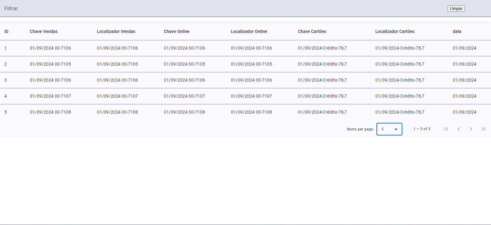

# Tabela com Angular Material UI

Nesta tabela consta recursos como filtro, classificação ordenada e reversa, paginação com 2, 4 e 5 itens.

O objetivo deste projeto foi para conhecer alguns recursos que o angular material ui pode oferecer para tabelas.

